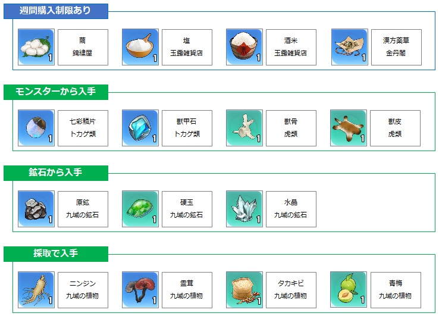
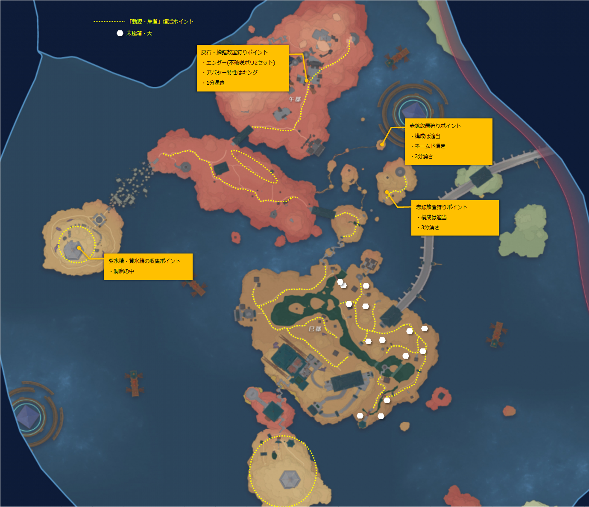

# 九域

## 域幣
### 域幣の入手方法
* 雷州2層目のサブクエスト(1回のみ)
* 各種イベント(不定期)
* 漢方薬草の回収商(1回のみ)
* 栄盛質屋でアイテム売却
  * 青龍神像・尾のレベルを上げることで売値が向上する
  * 売却できるアイテムの種類と数量は1カ月単位で更新される
  * 単価は毎日変動
  * 売却するアイテムの入手方法は掲示板
* 飼育代理屋でペット売却
  * 青龍神像・尾のレベルを上げることで売値が向上する
  * 売却できるアイテムの種類と数量は1カ月単位で更新される
  * 単価は毎日変動

### 掲示板
* 依頼は最大3つ表示できる
* アイテムを納品すると報酬として栄盛質屋で売却できるアイテムが入手できる
* 完了すると次の依頼を受けることができる
* 必要なアイテムと入手方法は以下参照

## 雷州

### 青龍神像おすすめ解放順（探索重視）
* 青龍神像・箕Lv4：星辰碑の封印を解放
* 青龍神像・心Lv3：玄陣街道プレイモードを解放
* 青龍神像・氐Lv3：開放すると雷怒宝箱の効果を無効化できる
* 青龍神像・箕Lv6：開放すると星辰碑探索の表示範囲を拡大できる
* 青龍神像・房Lv4：開放すると星宿宝箱を開封し、一部の商店の商品スペースを２つ解放できる
* 青龍神像・角Lv4：流転域泉を解放すると報酬獲得

### 青龍神像・箕

| レベル | 動源・青龍 | 効果 |
| --- | --- | --- |
| 壱 | 0 | モンスター弱体効果が大幅UP |
| 弐 | 800 | 星辰碑復活機能を解放 |
| 参 | 1500 | モンスター弱体効果が大幅UP |
| 肆 | 2500 | 星辰碑の封印を解放 |
| 伍 | 3500 | モンスター弱体効果が超大幅UP |
| 陸 | 4500 | 開放すると星辰碑探索の表示範囲を拡大できる |

### 青龍神像・心

| レベル | 動源・青龍 | 効果 |
| --- | --- | --- |
| 壱 | 0 | 開放すると、連携スキルの追加ダメージが大幅にUP |
| 弐 | 800 | 雷州モンスターを倒すと、一定確率で２倍の素材を獲得 |
| 参 | 1500 | 玄陣街道プレイモードを解放 |
| 肆 | 2500 | 連携スキルの追加ダメージが大幅にUP |
| 伍 | 3500 | 開放時に一定確率で採取の報酬2倍 |
| 陸 | 4500 | 連携スキルの追加ダメージが超大幅にUP |

### 青龍神像・氐

| レベル | 動源・青龍 | 効果 |
| --- | --- | --- |
| 壱 | 0 | 開放すると、武器スキルの追加ダメージが大幅にUP |
| 弐 | 800 | 開放すると掃討リストのモンスターの位置を表示 |
| 参 | 1500 | 開放すると雷怒宝箱の効果を無効化できる |
| 肆 | 2500 | 武器スキルの追加ダメージが大幅にUP |
| 伍 | 3500 | 開放すると最大HPを大幅にUPできる（他の青龍神像の効果と重ね掛け可能） |
| 陸 | 4500 | 武器スキルの追加ダメージが超大幅にUP |

### 青龍神像・亢

| レベル | 動源・青龍 | 効果 |
| --- | --- | --- |
| 壱 | 0 | 追加の雷攻撃力が大幅にUP、兵備局での域幣の鋳造が10%OFF |
| 弐 | 800 | ボスへの追加与ダメージが大幅にUP |
| 参 | 1500 | 追加の雷攻撃力が大幅にUP、兵備局での域幣の鋳造が20%OFF |
| 肆 | 2500 | ボスへの追加与ダメージが大幅にUP |
| 伍 | 3500 | 追加の雷攻撃力が超大幅にUP、兵備局での域幣の鋳造が30%OFF |
| 陸 | 4500 | 低確率で雷州モンスターを瞬殺できる |

### 青龍神像・尾

| レベル | 動源・青龍 | 効果 |
| --- | --- | --- |
| 壱 | 0 | 開放すると天河街の一部の商店で域幣による買い物が10％OFF |
| 弐 | 800 | 開放すると飼育代理店での売り値が10%UP |
| 参 | 1500 | 開放すると天河街の一部の商店で域幣による買い物が20％OFF |
| 肆 | 2500 | 開放すると飼育代理店での売り値が20%UP |
| 伍 | 3500 | 開放すると天河街の一部の商店で域幣による買い物が30％OFF |
| 陸 | 4500 | 開放すると飼育代理店での売り値が30%UP |

### 青龍神像・角

| レベル | 動源・青龍 | 効果 |
| --- | --- | --- |
| 壱 | 0 | 開放すると、通常攻撃に大量の青龍ダメージを付与できる |
| 弐 | 800 | 開放すると最大HPを大幅にUPできる（他の青龍神像の効果と重ね掛け可能） |
| 参 | 1500 | 通常攻撃の青龍ダメージを大幅UP |
| 肆 | 2500 | 流転域泉を解放すると報酬獲得 |
| 伍 | 3500 | 通常攻撃の青龍ダメージを超大幅UP |
| 陸 | 4500 | 開放すると星辰碑に映される宝箱・青龍の表示範囲を拡大できる |

### 青龍神像・房

| レベル | 動源・青龍 | 効果 |
| --- | --- | --- |
| 壱 | 0 | 開放するとモンスター撃破EXPがアップ |
| 弐 | 800 | 開放すると最大HPを大幅にUPできる（他の青龍神像の効果と重ね掛け可能） |
| 参 | 1500 | 開放すると麒麟と窮寄の特殊ダメージを無効化できる |
| 肆 | 2500 | 開放すると星宿宝箱を開封し、一部の商店の商品スペースを２つ解放できる |
| 伍 | 3500 | 最大HPを大幅にUPできる（他の青龍神像の効果と重ね掛け可能） |
| 陸 | 4500 | 開放すると範囲内のマップにある材料とモンスターの位置を表示し、一部の商店の商品スペースを３つ解放できる |

## 火州

### 便利マップ（動源復活ポイント）

### 便利マップ（商店）

### デイリークエスト
* 黄水精
* 紫水精
* 青火珠
* 秋海棠

### 九域アイテム

| アイテム | 入手方法 | コメント |
| --- | --- | --- |
| 鱗鎧 | 闇鬼〇〇 |  |
| 赤鉱 | 火鼠 | 放置狩り可能 |
| 灰石 | 瞑闇〇〇 | 放置狩り可能 |
| 凌晶 | 四足雀 |  |
| 黛岩 | 三尾、鎧鹿、鎧熊 |  |
| 朱厭の鱗 | 朱厭 | 箱ではなくドロップ |
| 紫水精 | 採取 | デイリークエストで使用する |
| 黄水精 | 採取 | デイリークエストで使用する |
| 秋海棠 | 採取 | デイリークエストで使用する |
| 青火珠 | 採取 | デイリークエストで使用する |

### 朱雀神像おすすめ解放順
* 神像・翼Lv.5：星宿宝箱を解除可能
* 神像・翼Lv.6：探索ポイントの表示範囲が拡大
* 神像・柳Lv.4：封印された朱雀星辰碑が開放
* 神像・車Lv.4：封印されたエリアが開放
* 神像・張Lv.2：ギミック「流転域泉」解除に炎属性武器による攻撃が不要になる。
* 神像・張Lv.3：火羽宝箱を解除可能

### 朱雀神像・星

| レベル | 動源・朱雀 | 効果 |
| --- | --- | --- |
| 壱 | 0 | 解放すると、連携スキルの追加ダメージが大幅にUP |
| 弐 | 600 | 火州モンスターを倒すと、低確率で2倍素材を獲得 |
| 参 | 900 | 解放すると最大HPを大幅にUPできる（他の朱雀神像の効果と重ね掛け可能） |
| 肆 | 1200 | 連携スキルの追加ダメージが大幅UP |
| 伍 | 1500 | 火州モンスターを倒すと一定確率で2倍素材を獲得 |
| 陸 | 1800 | 連携スキルの追加ダメージが超大幅UP |

### 朱雀神像・柳

| レベル | 動源・朱雀 | 効果 |
| --- | --- | --- |
| 壱 | 0 | モンスター弱体効果が大幅UP |
| 弐 | 600 | 炎ダメージ耐性を解放 |
| 参 | 900 | モンスター弱体効果が大幅UP |
| 肆 | 1200 | 星辰碑の封印を解放 |
| 伍 | 1500 | モンスター弱体効果が超大幅UP |
| 陸 | 1800 | 炎ダメージ耐性 |

### 朱雀神像・張

| レベル | 動源・朱雀 | 効果 |
| --- | --- | --- |
| 壱 | 0 | 解放すると、武器スキルの追加ダメージが大幅にUP |
| 弐 | 600 | 流転域泉の解放で完了 |
| 参 | 900 | 解放すると火羽宝箱の効果を無効化できる |
| 肆 | 1200 | 武器スキルの追加ダメージが大幅にUP |
| 伍 | 1500 | 解放すると最大HPを大幅にUPできる（他の朱雀神像の効果と重ね掛け可能） |
| 陸 | 1800 | 武器スキルの追加ダメージが超大幅にUP |

### 朱雀神像・車

| レベル | 動源・朱雀 | 効果 |
| --- | --- | --- |
| 壱 | 0 | 解放すると、通常攻撃に大量の朱雀ダメージを付与できる |
| 弐 | 150 | 解放すると最大HPを大幅にUPできる（他の朱雀神像の効果と重ね掛け可能） |
| 参 | 700 | 通常攻撃の朱雀ダメージを大幅UP |
| 肆 | 1250 | 解放すると朱雀の封印エリアに入れる |
| 伍 | 1800 | 通常攻撃の朱雀ダメージを超大幅UP |
| 陸 | 2250 | 最大HPを大幅にUPできる（他の朱雀神像の効果と重ね掛け可能） |

### 朱雀神像・翼

| レベル | 動源・朱雀 | 効果 |
| --- | --- | --- |
| 壱 | 0 | 解放すると移動速度UP |
| 弐 | 600 | 解放するとスタミナ消費を大幅に軽減できる |
| 参 | 900 | 解放すると最大HPを大幅にUPできる（他の朱雀神像の効果と重ね掛け可能） |
| 肆 | 1200 | 移動速度が大幅UP |
| 伍 | 1500 | 解放すると宝箱・星宿を解放できます |
| 陸 | 1800 | 解放すると星辰碑探索の表示範囲を拡大できる |

### 朱雀神像・井（Ver3.1）

| レベル | 動源・朱雀 | 効果 |
| --- | --- | --- |
| 壱 | 0 | 解放するとモンスター撃破EXPがアップ |
| 弐 | 600 | 解放すると最大HPを大幅にUPできる（他の朱雀神像の効果と重ね掛け可能） |
| 参 | 900 | 採集解放時に低確率で報酬2倍を獲得 |
| 肆 | 1200 | 最大HPを大幅にUPできる（他の朱雀神像の効果と重ね掛け可能） |
| 伍 | 1500 | 解放すると星辰碑に映される宝箱・朱雀の表示範囲を拡大できる |
| 陸 | 1800 | 採集解放時に一定確率で報酬2倍を獲得 |

### 朱雀神像・鬼（Ver3.1）

| レベル | 動源・朱雀 | 効果 |
| --- | --- | --- |
| 壱 | 0 | 追加の炎攻撃力が大幅にUP |
| 弐 | 600 | ボスへの追加与ダメージが大幅にUP |
| 参 | 900 | 炎攻撃力が大幅UP |
| 肆 | 1200 | ボスへの与ダメージが大幅UP |
| 伍 | 1500 | 炎攻撃力が超大幅UP |
| 陸 | 1800 | 低確率で火州モンスターを瞬殺できる |

### AIサーバント

| AIサーバント | 属性 | 好感度アイテム |
| --- | :---: | --- |
| アンジェラ | 氷| 凌晶(20)、黄水精(20)、**鱗鎧(20)** |
| 月うさぎ | 雷 | 黛岩(20)、紫水精(20)、**鱗鎧(20)** |
| 虚無の天使 | 炎 | 朱厭の鱗(40)、**赤鉱(20)**、紫水精(20) |
| カカ | 物理 | 朱厭の鱗(40)、**灰石(20)**、黄水精(20) |
| Mi-a戦闘相棒 | 異能 | 紫水精(20)、黄水精(20)、**鱗鎧(20)** |
| 火羽雀 | 炎 | 鳥の羽(40)、朱厭の鱗(40)、**赤鉱(20)** |
| 東雲 | 雷 | 饕餮晶丹(40)、**武器許可の割符(20)**、**鱗鎧(20)**
