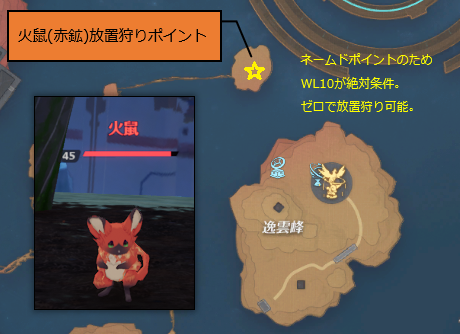

# 九域
## デイリークエスト
* 黄水精
* 紫水精
* 青火珠
* 秋海棠

## AIサーバント

| AIサーバント | 属性 | 好感度アイテム |
| --- | :---: | --- |
| アンジェラ | 氷| 凌晶(20)、黄水精(20)、**鱗鎧(20)** |
| 月うさぎ | 雷 | 黛岩(20)、紫水精(20)、**鱗鎧(20)** |
| 虚無の天使 | 炎 | 朱厭の鱗(40)、**赤鉱(20)**、紫水精(20) |
| カカ | 物理 | 朱厭の鱗(40)、**灰石(20)**、黄水精(20) |
| Mi-a戦闘相棒 | 異能 | 紫水精(20)、黄水精(20)、**鱗鎧(20)** |

## 九域アイテム

| アイテム | 入手方法 | コメント |
| --- | --- | --- |
| 鱗鎧 | 闇鬼〇〇 |  |
| 赤鉱 | 火鼠 | 放置狩り可能 |
| 灰石 | 瞑闇〇〇 | 放置狩り可能 |
| 凌晶 | 四足雀 |  |
| 黛岩 | 三尾、鎧鹿、鎧熊 |  |
| 朱厭の鱗 | 朱厭 | 箱ではなくドロップ |
| 紫水精 | 採取 | デイリークエストで使用する |
| 黄水精 | 採取 | デイリークエストで使用する |
| 秋海棠 | 採取 | デイリークエストで使用する |
| 青火珠 | 採取 | デイリークエストで使用する |

## 朱雀神像おすすめ解放順
* 神像・翼Lv.5：星宿宝箱を解除可能
* 神像・翼Lv.6：探索ポイントの表示範囲が拡大
* 神像・柳Lv.4：封印された朱雀星辰碑が開放
* 神像・車Lv.4：封印されたエリアが開放
* 神像・張Lv.2：ギミック「流転域泉」解除に炎属性武器による攻撃が不要になる。
* 神像・張Lv.3：火羽宝箱を解除可能

## 朱雀神像・星

| レベル | 動源・朱雀 | 効果 | チェック |
| --- | --- | --- | --- |
| 壱 | 0 | 解放すると、連携スキルの追加ダメージが大幅にUP | ★ |
| 弐 | 600 | 火州モンスターを倒すと、低確率で2倍素材を獲得 | ★ |
| 参 | 900 | 解放すると最大HPを大幅にUPできる（他の朱雀神像の効果と重ね掛け可能） | ★ |
| 肆 | 1200 | 連携スキルの追加ダメージが大幅UP | ★ |
| 伍 | 1500 | 火州モンスターを倒すと一定確率で2倍素材を獲得 |  |
| 陸 | 1800 | 連携スキルの追加ダメージが超大幅UP |  |

## 朱雀神像・柳

| レベル | 動源・朱雀 | 効果 | チェック |
| --- | --- | --- | --- |
| 壱 | 0 | モンスター弱体効果が大幅UP | ★ |
| 弐 | 600 | 炎ダメージ耐性を解放 | ★ |
| 参 | 900 | モンスター弱体効果が大幅UP | ★ |
| 肆 | 1200 | 星辰碑の封印を解放 | ★ |
| 伍 | 1500 | モンスター弱体効果が超大幅UP |  |
| 陸 | 1800 | 炎ダメージ耐性 |  |

## 朱雀神像・張

| レベル | 動源・朱雀 | 効果 | チェック |
| --- | --- | --- | --- |
| 壱 | 0 | 解放すると、武器スキルの追加ダメージが大幅にUP | ★ |
| 弐 | 600 | 流転域泉の解放で完了 | ★ |
| 参 | 900 | 解放すると火羽宝箱の効果を無効化できる | ★ |
| 肆 | 1200 | 武器スキルの追加ダメージが大幅にUP |  |
| 伍 | 1500 | 解放すると最大HPを大幅にUPできる（他の朱雀神像の効果と重ね掛け可能） |  |
| 陸 | 1800 | 武器スキルの追加ダメージが超大幅にUP |  |

## 朱雀神像・車

| レベル | 動源・朱雀 | 効果 | チェック |
| --- | --- | --- | --- |
| 壱 | 0 | 解放すると、通常攻撃に大量の朱雀ダメージを付与できる | ★ |
| 弐 | 150 | 解放すると最大HPを大幅にUPできる（他の朱雀神像の効果と重ね掛け可能） | ★ |
| 参 | 700 | 通常攻撃の朱雀ダメージを大幅UP | ★ |
| 肆 | 1250 | 解放すると朱雀の封印エリアに入れる | ★ |
| 伍 | 1800 | 通常攻撃の朱雀ダメージを超大幅UP | ★ |
| 陸 | 2250 | 最大HPを大幅にUPできる（他の朱雀神像の効果と重ね掛け可能） | ★ |

## 朱雀神像・翼

| レベル | 動源・朱雀 | 効果 | チェック |
| --- | --- | --- | --- |
| 壱 | 0 | 解放すると移動速度UP | ★ |
| 弐 | 600 | 解放するとスタミナ消費を大幅に軽減できる | ★ |
| 参 | 900 | 解放すると最大HPを大幅にUPできる（他の朱雀神像の効果と重ね掛け可能） | ★ |
| 肆 | 1200 | 移動速度が大幅UP | ★ |
| 伍 | 1500 | 解放すると宝箱・星宿を解放できます | ★ |
| 陸 | 1800 | 解放すると星辰碑探索の表示範囲を拡大できる | ★ |
