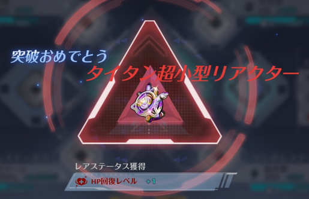

# タイタン装備

## タイタン化した時のイメージ

## レアステータス
### レアステータス一覧

| レアステータス | 部位 |
| --- | --- |
| スロウレベル | ガントレット |
| 回復UPレベル | ガントレット |
| 通常攻撃ダメージUPレベル | ガントレット |
| スキルダメージUPレベル | ガントレット |
| ダメージUPレベル | ガントレット |
| 弱点ダメージUPレベル | ガントレット |
| HP吸収レベル | リアクター |
| HP回復レベル | リアクター |
| ブロックレベル | リアクター |
| ダメージ軽減レベル | リアクター |
| 回避攻撃ダメージUPレベル | リアクター |
| 連携ダメージUPレベル | リアクター |

### スキルダメージUPレベル
* スキルで与える直接ダメージがアップする

| Lv | 数値 |
| :--: | ---: |
| 1 | +4.615% |
| 2 | +6.154% |
| 3 | +7.692% |
| 4 | +9.231% |
| 5 | +10.769% |
| 6 | +12.000% |
| 7 | +13.231% |
| 8 | +14.462% |
| 9 | +15.692% |

### ダメージUPレベル
* 与ダメージがアップする

| Lv | 数値 |
| :--: | ---: |
| 1 | +1.200% |
| 2 | +1.600% |
| 3 | +2.000% |
| 4 | +2.400% |
| 5 | +2.500% |
| 6 | +3.120% |
| 7 | +3.440% |
| 8 | +3.760% |
| 9 | +4.080% |

### 弱点ダメージUPレベル
* モンスターの弱点属性ダメージを与えるとダメージがアップする

| Lv | 数値 |
| :--: | ---: |
| 1 | +3.000% |
| 2 | +4.000% |
| 3 | +5.000% |
| 4 | +6.000% |
| 5 | +7.000% |
| 6 | +7.800% |
| 7 | +8.600% |
| 8 | +9.400% |
| 9 | +10.200% |

### HP回復レベル
* 非戦闘状態時は5秒ごとに最大HPの一定比率を自動回復する。
* 戦闘状態中は回復が半減する。

| Lv | 数値 |
| :--: | ---: |
| 1 | +3.150% |
| 2 | +4.200% |
| 3 | +5.250% |
| 4 | +6.300% |
| 5 | +7.350% |
| 6 | +8.190% |
| 7 | +9.030% |
| 8 | +9.870% |
| 9 | +10.710% |

### ダメージ軽減レベル
* 被ダメージがダウンする

| Lv | 数値 |
| :--: | ---: |
| 1 | +1.200% |
| 2 | +1.600% |
| 3 | +2.000% |
| 4 | +2.400% |
| 5 | +2.500% |
| 6 | +3.120% |
| 7 | +3.440% |
| 8 | +3.760% |
| 9 | +4.080% |
