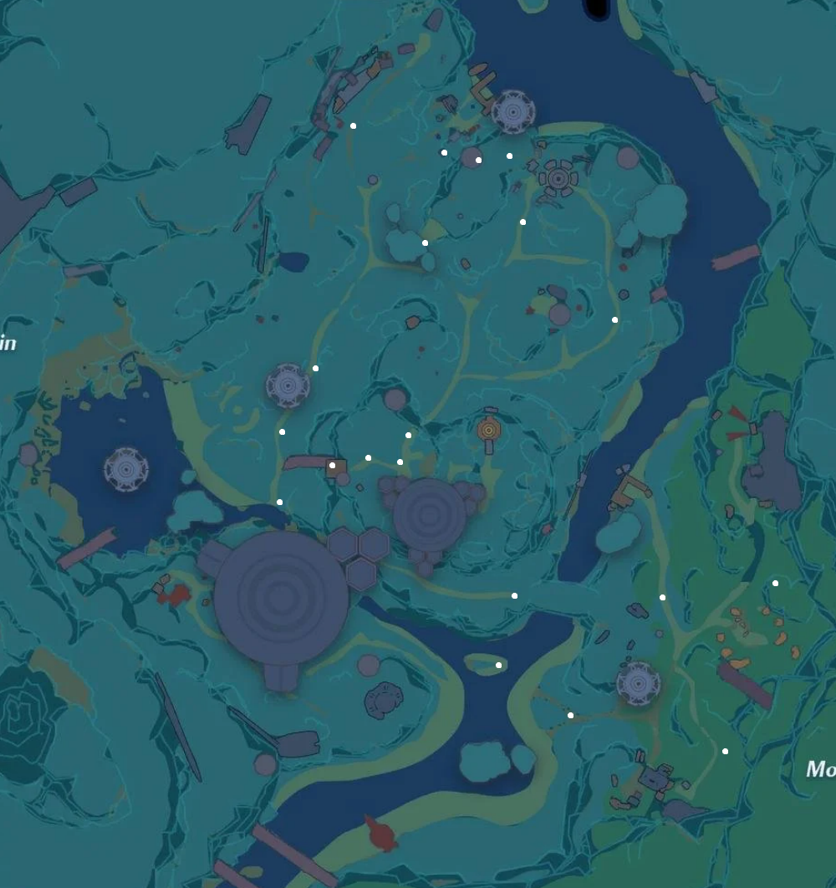

# 謎の商人

## 販売アイテム

| アイテム | 価格 | 数量 |
| --- | --- | --- |
| レッドコアx1 | エナジー材料x300 | 1 |
| ゴールドコアx2 | 繊維素材x200 | 2～4 |
| スペシャルクーポンx1 | 装飾素材x300 | 1 |
| 検索クーポンx2 | 装飾素材x200 | 2～4 |
| 要塞外骨格の欠片x4 | 金属素材x480 | 3 |
| 要塞超小型リアクターの欠片x8 | エナジー材料x240 | 2～4 |
| コア制御モジュールx2 | エナジー材料x320 | 1 |
| 突破因子x8 | エナジー材料x160 | 1 |
| 活力薬x1 | 補給素材x100 | 1～2 |
| データ中継器x1 | 装飾素材x200 | 1～4 |
| ランクアップモジュールⅡx2 | 補給素材x400 | 1～4 |
| 強化モジュールⅡx8 | 補給素材x320 | 2～4 |
| 連合補給チップⅠx1 | 繊維素材x200 | 3～4 |

## みつけた場所

## ゲーム内プレイ説明
### 謎の商人
1. 謎の商人は12:00:00に一定の確率で現れます。出現場所はランダムです。
2. 謎の商人が出現している間、プレイヤーの人工島メイン画面に謎の商人愛好と終了までのカウントダウンが表示されます。
3. 謎の商人の商品には人工島の主人専用の商品と共有商品があり、共有商品は他のプレイヤーも購入できます。
4. 1週間に8回まで、他のプレイヤーの人工島で商品を購入できます。
