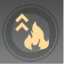

# 起源の戦域

## 仕様
* 難易度は100%、1800%、1500%、1000%、700%、400%、200%、100%がある
* 各ステージごとに獲得できるバフが決まっており、クリア時に確率で入手可能
  * バフごとにドロップ率が違う
  * バフを集めるには周回が必要
* 【ドロップ不可】と記載されているバフは、そのステージでモンスターが使用するバフ
* ランキングは階数、倍率、クリア時間で順位が決まる
   * チーム内での順位は上記に加えて戦闘統計も考慮される（恩恵と剛毅・・・）

## バフ一覧

| 装備 | アイコン | バフ名 | 効果 |
| :--: | :--: | --- | --- |
| 左上 |  | 炎ダメージUPⅠ/Ⅱ/Ⅲ/Ⅳ/Ⅴ | 炎ダメージ+10%/20%/30%/40%/50% |

## ゲーム内プレイ説明
### 起源の戦域
* 4人チームで挑むシーズン制のダンジョン(合計25階)です。
* 各階ごとに異なるステージタイトルがあり、事前に戦略を練る必要があります。
* チーム内に高層階のプレイヤーがいる場合は、高層階への挑戦成功後に高層階までジャンプできます。
* 挑戦開始時に現在有効中の【武器】【アルケー】のバフは解消され、すべての武器召喚物もリセットされます。
* プレイ中に全モンスターが不屈かつ幻想タイム無効になり、剛毅共鳴を持つキャラクターへのダメージがダウンします。
* シーズン開始時、各階ごとに難易度が倍率が設定されます。
* 難易度倍率は時間の経過とともに減少し、最終的には100%になります。
* シーズン中の突破階数に基づいて全サーバーランキングを作成し、精算時に限定称号を獲得します。

### ステージのタイトル
* クリア時に一定確率でその階のタイトルを獲得し、以降の挑戦で選択できます。
* 1つのタイトルは1回のみ獲得でき、最大で6つのタイトルを装備できます。
* 各タイトルは装備枠が指定されているので、バッグ左上にある枠指定マークを確認してください。
* 獲得したタイトルはシーズン終了時に全て回収されます。
