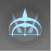
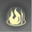
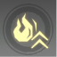

# 起源の戦域(ver2.5)

## 仕様
* 難易度は100%、1800%、1500%、1000%、700%、400%、200%、100%がある
* 各ステージごとに獲得できるバフが決まっており、クリア時に確率で入手可能
  * バフごとにドロップ率が違う
  * バフを集めるには周回が必要
* 【ドロップ不可】と記載されているバフは、そのステージでモンスターが使用するバフ
* ランキングは階数、倍率、クリア時間で順位が決まる
   * チーム内での順位は上記に加えて戦闘統計も考慮される（恩恵と剛毅・・・）

## バフ一覧

| 装備 | アイコン | バフ名 | 効果 |
| :--: | :--: | --- | --- |
| 左上 |  | 炎ダメージUPⅠ/Ⅱ/Ⅲ/Ⅳ/Ⅴ | 炎ダメージ+10%/20%/30%/40%/50% |
| 左上 |  | 氷ダメージUPⅠ/Ⅱ/Ⅲ/Ⅳ/Ⅴ | 氷ダメージ+10%/20%/30%/40%/50% |
| 左上 |  | 雷ダメージUPⅠ/Ⅱ/Ⅲ/Ⅳ/Ⅴ | 雷ダメージ+10%/20%/30%/40%/50% |
| 左上 |  | 物理ダメージUPⅠ/Ⅱ/Ⅲ/Ⅳ/Ⅴ | 物理ダメージ+10%/20%/30%/40%/50% |
| 右上 |  | アルカイオスⅠ/Ⅱ/Ⅲ | 戦闘開始後、攻撃力+10%/15%/20% |
| 右上 |  | バースト達人Ⅰ/Ⅱ/Ⅲ | 会心ダメージ+10%/15%/20% |
| 右上 |  | 支援の手Ⅰ/Ⅱ/Ⅲ | 半径10m以内の味方(自身を含まない)の最終ダメージ+5%/10%/15% |
| 右上 |  | 癒しの天使Ⅰ/Ⅱ/Ⅲ | 回復効果+15%/30%/50% |
| 右上 |  | 強力タンクⅠ/Ⅱ/Ⅲ | 最大HP+120000/+300000/+600000 |
| 左 |  | 治療制御 | ダメージを与えた時、ターゲットが受ける回復効果-60%、5秒持続 |
| 左 |  | 異能グローブ | ダメージを与えた時、攻撃力x1500%の異能ダメージを1回付与、クールダウン10秒 |
| 左 |  | 血の渇望 | 現在のHPが低いほど与えるダメージが多くなり、最大40%UPする |
| 左 |  | 斬殺 | ターゲットの現在のHPが10%未満の場合、倒すことができる |
| 左 |  | 狂戦士 | 自身の現在のHPが低いほど与えるダメージが多くなり、最大40%UPする |
| 右 |  | 避雷針 | 優先的に落雷のターゲットになる |
| 右 |  | 攻撃解消 | ダメージを与えた時、ターゲットに付与された攻撃バフを解消、クールダウン30秒 |
| 右 |  | サーマルイメージング | 燃焼のダメージ+25% |
| 左下 |  | 静電ブロック | 雷ダメージを1回無効化、クールダウン4.5秒 |
| 左下 |  | 断熱削磁 | 感電ターゲットへの氷ダメージ+50% |
| 左下 |  | 異能への恐れ | 異能被ダメージ+30%、異能以外の被ダメージ-30% |
| 左下 |  | 異能アーマー | 異能被ダメージ-30%、異能以外の被ダメージ+30% |
| 左下 |  | 熱核融合 | 重傷状態のターゲットへの炎ダメージ+50% |
| 左下 |  | ハイパワー物理 | 燃焼状態のターゲットへの物理ダメージ+50% |
| 左下 |  | 低温超電導 | 凍傷ターゲットへの雷ダメージ+50% |
| 左下 |  | 緊急防御 | 自身の現在のHPが10%未満の場合、被ダメージ-80% |
| 右下 |  | 時間強化 | 毎秒、自身の攻撃力x1%UPし、最大で攻撃力x30%までスタックできる |
| 右下 |  | 鉄人 | スタミナ消費-30%、移動速度+20% |
| 右下 |  | 勇気の心Ⅰ/Ⅱ | 毎秒、HPの1.2%/2.5%を回復 |
| - |  | 凍結の達人 | 凍傷ターゲットへの会心率+50% |
| - |  | 氷の麗人 | ダメージ+20%、ただし凍傷状態になるごとに凍傷時間+2秒 |
| - |  | 凍結防止 | 凍結状態にされない |
| - |  | 潜む危険 | 炎被ダメージ+50% |
| - |  | 燃焼フィールド | 60秒ごとにすべての敵ターゲットに燃焼状態にし、30秒持続 |
| - |  | 落雷 | フィールド内で5秒ごとに任意のユニットに落雷し（【避雷針】を持つユニットが優先）、300000のダメージを与える |
| - |  | 感電フィールド | 60秒ごとにすべての敵ターゲットに感電状態にし、30秒持続 |
| - |  | 重傷フィールド | 60秒ごとにすべての敵ターゲットに重傷状態にし、30秒持続 |
| - |  | 凍傷フィールド | 60秒ごとにすべての敵ターゲットに凍傷状態にし、30秒持続 |
| - |  | 増幅器 | 攻撃バフが5倍になる |
| - |  | 恐怖の地 | フィールド内ではHPが減少し続ける。毎秒最大HPの5％を失い、かつHP回復が-80％。ただし【勇気の心】で回復効果が2倍 |
| - |  | そよ風 | エリア内に時々ハリケーンが吹き、ターゲットを吹き飛ばす。不屈無視 |
| - |  | 禁足 | 命中したターゲットに禁足を追加、5秒間持続。ターゲットが1m移動するごとに攻撃力x200%のダメージを与える。毎秒の累計ダメージは最大400% |
| - |  | レーザーバリア | エリア内に移動するレーザーが出現し毎回キャラに最大HPx15%のダメージを与える |
| - |  | 防爆装甲Ⅰ/Ⅱ | バイオレンスアップによる被ダメージ-80%/90% |
| - |  | 灼熱の地 | キャラが燃焼を受け続け、最大HPx1%を毎秒失う |
| - |  | 低温アイスブレイク | 凍傷ターゲットへの物理ダメージ+50% |
| - |  | ニヒリティ | 2.5秒ごとに被ダメージを1回無効化する |
| - |  | バイオレンスアップ | 2秒ごとに自身はバースト値を1スタック累積する。5スタックになると爆発し、周囲にいる敵味方無差別のターゲットに攻撃力x3000%の炎ダメージを与える |
| - |  | 電気伝導 | 雷被ダメージ+30% |
| - |  | ブラックホール | 40秒ごとにターゲットをロックオンし、自動でブラックホールを放つ。ブラックホールは20秒間持続。攻撃力x200%のダメージを毎秒与える |
| - |  | コアバースト | 燃焼ターゲットへの雷ダメージ+50% |
| - |  | 重量化 | 体が重くなり、吹き飛ばされない |

## ゲーム内プレイ説明
### 起源の戦域
* 4人チームで挑むシーズン制のダンジョン(合計25階)です。
* 各階ごとに異なるステージタイトルがあり、事前に戦略を練る必要があります。
* チーム内に高層階のプレイヤーがいる場合は、高層階への挑戦成功後に高層階までジャンプできます。
* 挑戦開始時に現在有効中の【武器】【アルケー】のバフは解消され、すべての武器召喚物もリセットされます。
* プレイ中に全モンスターが不屈かつ幻想タイム無効になり、剛毅共鳴を持つキャラクターへのダメージがダウンします。
* シーズン開始時、各階ごとに難易度が倍率が設定されます。
* 難易度倍率は時間の経過とともに減少し、最終的には100%になります。
* シーズン中の突破階数に基づいて全サーバーランキングを作成し、精算時に限定称号を獲得します。

### ステージのタイトル
* クリア時に一定確率でその階のタイトルを獲得し、以降の挑戦で選択できます。
* 1つのタイトルは1回のみ獲得でき、最大で6つのタイトルを装備できます。
* 各タイトルは装備枠が指定されているので、バッグ左上にある枠指定マークを確認してください。
* 獲得したタイトルはシーズン終了時に全て回収されます。
